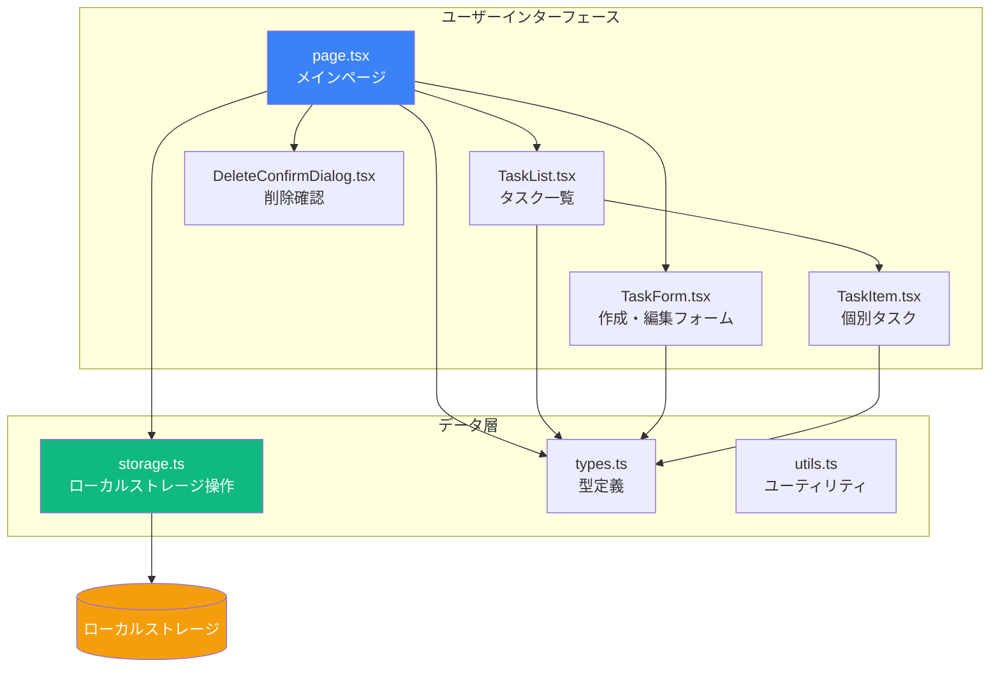
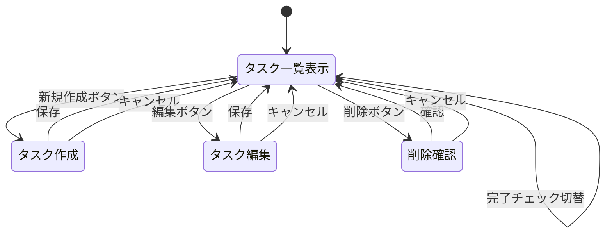

# タスク管理アプリケーション

Next.js 15（App Router）を使用したシンプルなタスク管理アプリケーションです。ローカルストレージを使用してデータを永続化し、直感的なUIでタスクの作成・編集・削除・完了管理ができます。

## 機能

- ✅ タスクの作成・編集・削除
- ✅ タスクの完了状態の切り替え
- ✅ ローカルストレージによるデータ永続化
- ✅ レスポンシブデザイン
- ✅ リアルタイムでの状態更新

## 技術スタック

- **フレームワーク**: Next.js 15（App Router）
- **言語**: TypeScript
- **スタイリング**: Tailwind CSS
- **状態管理**: React Hooks（useState, useEffect）
- **データストレージ**: ブラウザのローカルストレージ

## アーキテクチャ



## ディレクトリ構造

```
app/
├── layout.tsx              # ルートレイアウト
├── page.tsx                # メインページ（タスク一覧）
└── globals.css             # グローバルスタイル

components/
├── TaskList.tsx            # タスク一覧コンポーネント
├── TaskItem.tsx            # 個別タスクコンポーネント
├── TaskForm.tsx            # タスク作成・編集フォーム
└── DeleteConfirmDialog.tsx # 削除確認ダイアログ

lib/
├── types.ts                # 型定義
├── storage.ts              # ローカルストレージ操作
└── utils.ts                # ユーティリティ関数
```

## データモデル

```typescript
interface Task {
  id: string;              // UUID
  title: string;           // タスクのタイトル（必須、最大100文字）
  description: string;     // タスクの説明（任意、最大500文字）
  completed: boolean;      // 完了状態
  createdAt: number;       // 作成日時（Unix timestamp）
  updatedAt: number;       // 更新日時（Unix timestamp）
}
```

## ユーザーフロー



## セットアップ

### 前提条件

- Node.js 18.x 以上
- npm または yarn

### インストール

```bash
# リポジトリのクローン
git clone <repository-url>
cd spec-based-next-tasks

# 依存関係のインストール
npm install

# 開発サーバーの起動
npm run dev
```

ブラウザで [http://localhost:3000](http://localhost:3000) を開いてアプリケーションを確認できます。

## 使い方

### タスクの作成

1. 「新しいタスクを追加」ボタンをクリック
2. タイトルと説明を入力
3. 「保存」ボタンをクリック

### タスクの編集

1. 編集したいタスクの「編集」ボタンをクリック
2. タイトルや説明を変更
3. 「保存」ボタンをクリック

### タスクの削除

1. 削除したいタスクの「削除」ボタンをクリック
2. 確認ダイアログで「削除」を選択

### タスクの完了

- タスクのチェックボックスをクリックして完了/未完了を切り替え
- 完了したタスクは取り消し線と薄い色で表示されます

## 開発

### ビルド

```bash
npm run build
```

### 本番環境での起動

```bash
npm start
```

### リント

```bash
npm run lint
```

## 主要コンポーネント

### page.tsx
アプリケーション全体の状態管理を担当。タスクの CRUD 操作とローカルストレージへの永続化を実装。

### TaskList.tsx
タスクの一覧を表示。作成日時の降順でソートし、各タスクを TaskItem コンポーネントでレンダリング。

### TaskItem.tsx
個別タスクの表示と操作（完了チェック、編集、削除）を提供。完了タスクは視覚的に区別。

### TaskForm.tsx
タスクの作成・編集フォーム。バリデーション機能を持ち、タイトルが必須。

### DeleteConfirmDialog.tsx
タスク削除前の確認ダイアログ。誤削除を防止。

## データ永続化

- すべてのタスクはブラウザのローカルストレージに保存されます
- ストレージキー: `tasks`
- データ形式: JSON文字列化されたTask配列
- ページリロード後も自動的にデータが復元されます

## エラーハンドリング

- タイトル未入力時のバリデーションエラー
- ローカルストレージの読み書きエラーのハンドリング
- エラー発生時のコンソールログ出力

## パフォーマンス

- 推奨タスク数上限: 1000件
- データ保存・読み込み: 500ミリ秒以内
- React.memoとuseCallbackによる最適化

## ブラウザサポート

- Chrome（最新版）
- Firefox（最新版）
- Safari（最新版）
- Edge（最新版）

ローカルストレージをサポートするモダンブラウザで動作します。

## ライセンス

MIT

## 開発プロセス

このプロジェクトは Kiro を使用した spec 駆動開発で作成されました。要件定義、設計、実装タスクの各フェーズを経て開発されています。

詳細は `.kiro/specs/task-management-app/` ディレクトリ内のドキュメントを参照してください：
- `requirements.md` - 要件定義書
- `design.md` - 設計書
- `tasks.md` - 実装タスク一覧
